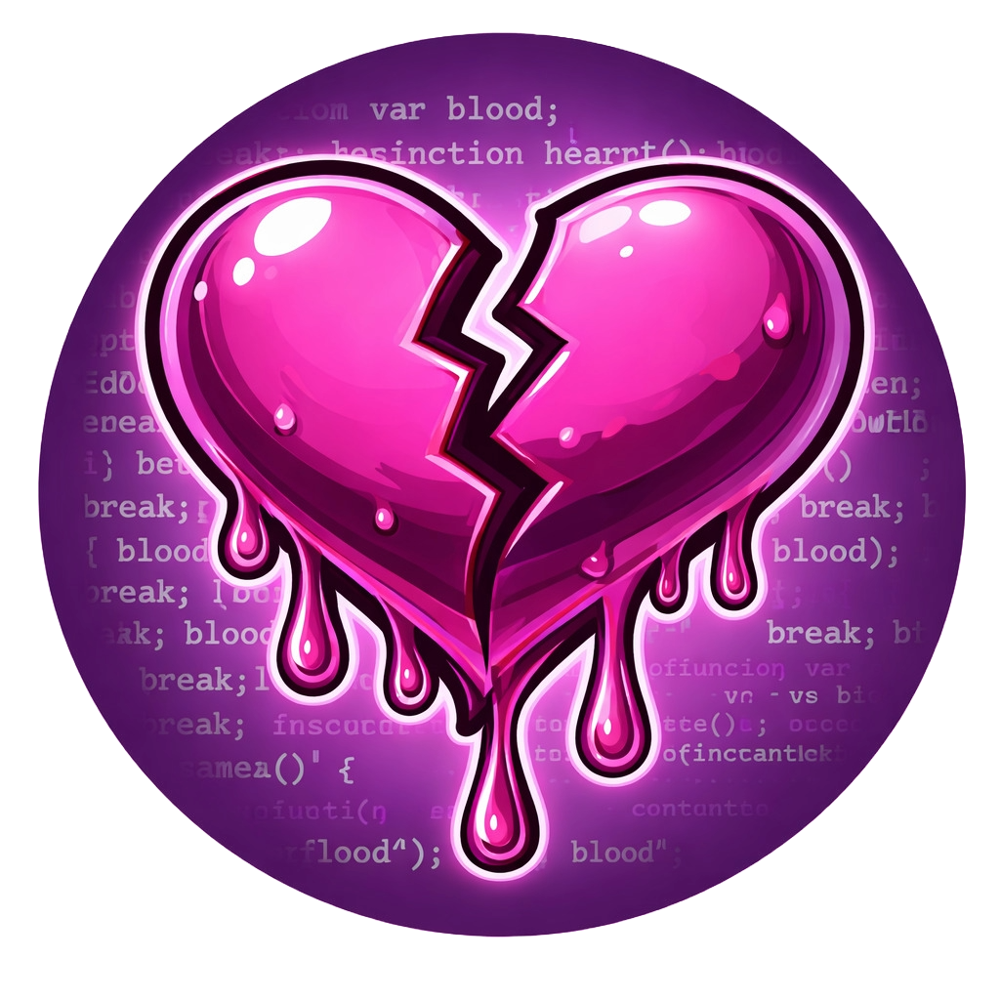

# My TryHackMe Rooms
Here I present the rooms I’ve designed, with links to each room and write-up.

|Picture| Room | Difficulty | Focus | Links to room |Write-up|
|-------|------|------------|-------|---------------|--------|
| | I'm a SANDWICH | Easy | 🌐 Web / 🕵️ Stéganographie / 📁 FTP Anonymous   🔐 PrivEsc / 💣 Brute-force (John, CuPP) | [THM - I'm a SANDWICH](https://tryhackme.com/jr/imasandwich) | [Write-up - by Opium](https://thewardenmaker.github.io/posts/THM-Sandwich/)
| | Who am I ? | Medium | 🌐 Web / 🕵️ Stéganographie / 💣 Brute-force / 🔍 Reconnaissance / 🗝️ Cryptographie | [THM - Who Am I](https://tryhackme.com/jr/whoamI)| Write-up   Coming soon
| | Born to Burn | Medium | 🌐 Web / 🔐 PrivEsc / 💣 Brute-force (John, CuPP) | [THM - Born to Burn](https://tryhackme.com/jr/borntoburn)| Write-up   Coming soon
| | Blood Heart | Hard | 🌐 Web / 🔐 PrivEsc / 💣 Brute-force / 🎭 Social Engineering | THM - Blood Heart Coming soon | Write-up Coming soon

⚠️​ Since on TryHackMe, even with a premium subscription, you're limited to uploading three machines, only two or three rooms are active at a time while waiting for the platform to publish them.

# My HackTheBox Rooms
Here I present the rooms I’ve designed, with links to each room and write-up.

|Picture| Room | Difficulty | Focus | Links to room |Write-up|
|-------|------|------------|-------|---------------|--------|
| | Glutton | Medium |  | [HTB - Glutton - Coming soon](https://tryhackme.com/jr/imasandwich) | [Write-up - Coming soon]

⚠️​ Since on TryHackMe, even with a premium subscription, you're limited to uploading three machines, only two or three rooms are active at a time while waiting for the platform to publish them.
